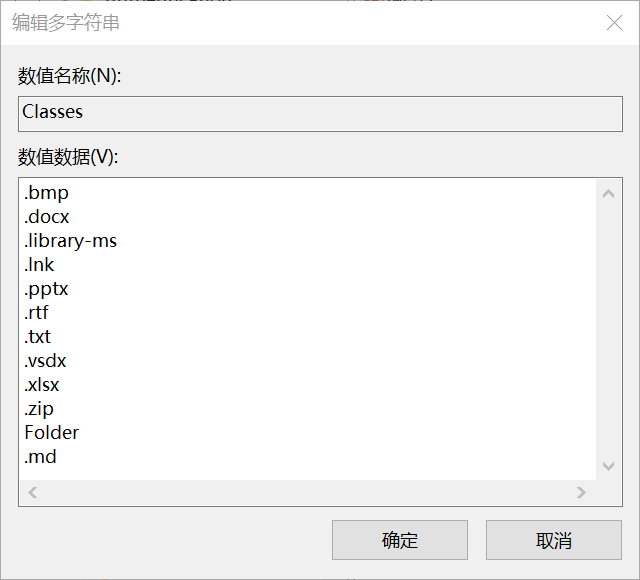
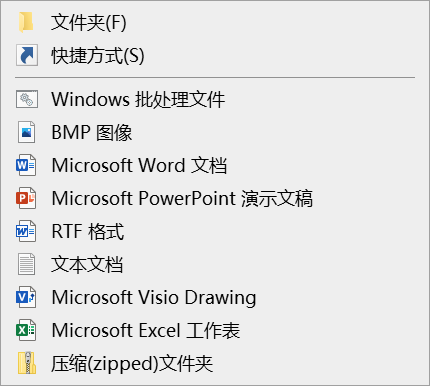
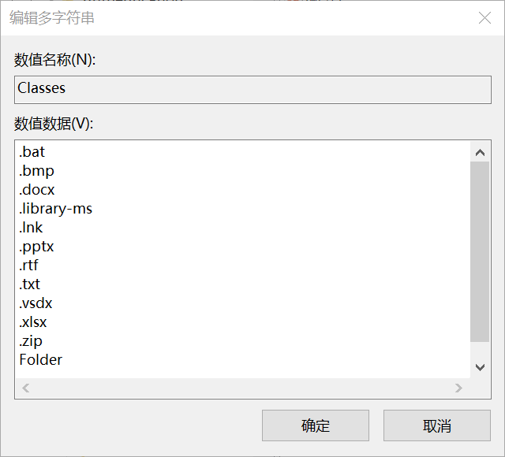

在今天准备写第一篇个人博客的时候，突然觉得每次右键新建`.txt`再更改为`.md`有些繁琐，便有了右键直接创建`.md`文档的需求，在一番研究之下，最终成功实现了目标

<!-- truncate -->

## 网上的方法

在Bing搜索与GPT询问的方法如出一辙：

1. 按下 `Win + R` 打开运行命令，输入 `regedit` 后按回车打开注册表编辑器。
2. 在注册表编辑器中，找到 `HKEY_CLASSES_ROOT` 键。这个键下的子项代表系统中所有的文件类型。
3. 选择或创建一个代表你想要新建的文件类型的键。例如，如果你想在右键菜单中添加创建 `.txt` 文件的选项，你应该找到或创建一个名为 `.txt` 的键。
4. 选中你的文件类型键，然后右键选择 **新建** -> **项**，并命名为 `ShellNew`。如果不包含这个子键，右键菜单上就不会有新建此类型文件的选项。
5. 在`ShellNew`键下，选择 **新建** -> **字符串值**，并命名为 `NullFile`。此值通知 Windows 在用户选择新建此类型文件时，应生成一个空的文件。
6. 重启`explorer`之后应该可以看到新建菜单中出现了想要的文件格式

### 排查问题

在实操过程中，重启`explorer`并没有出现`.md`文件格式，开始了排查问题之路

#### 修改文件Classes

在评论区看到可以在`计算机\HKEY_CURRENT_USER\SOFTWARE\Microsoft\Windows\CurrentVersion\Explorer\Discardable\PostSetup\ShellNew`文件夹中双击编辑`Classes`文件，添加`.md`后缀



这些类型与新建菜单里的类型一一对应，导致我认为该值是新建菜单的配置，于是向着修改这个值的方向前进

#### 问题

修改`classes`值并重启`explorer`之后，新建菜单中并没有出现`.md`，我返回查看`classes`值，发现无法编辑该值，Bing搜索之后得知是权限问题，但修改之后仍无法重新编辑


最后发现点击任意项再点击`ShellNew`项，`classes`值仍然可以编辑，并且修改的权限也会回退，因此可以确信并非用户权限问题，再次编辑发现`classes`值并没有修改成功，依旧为修改前的值。

#### 原因

这不禁让我想起以前遇到的某个文件无法写入的问题，最后弄明白原来那个文件是自动更新，因此每次写入都无法覆盖

于是我尝试着将`.bat`添加到新建菜单：



成功！

并且`classes`值也有了`.bat`



猜测`classes`值是由系统自动更新，用于展示映射关系而不是配置

自此便知道了修改`classes`值的方法是错误的

## 解决办法

在网上继续寻找之后发现运行这段注册表编辑文件即可解决

```Windows Registry Editor Version 5.00
[HKEY_CLASSES_ROOT\.md]
@="Typora.md"
"PerceivedType"="text"

[HKEY_CLASSES_ROOT\.md\ShellNew]
"NullFile"=""
"FileName"=""
```

观察之后发现其主要区别在于`.md`的默认值设置为`Typora.md`，设置为`Markdown`或`Markdown.md`均无效

而将默认值设置为`.md`会导致右键新建时无限重启`explorer`